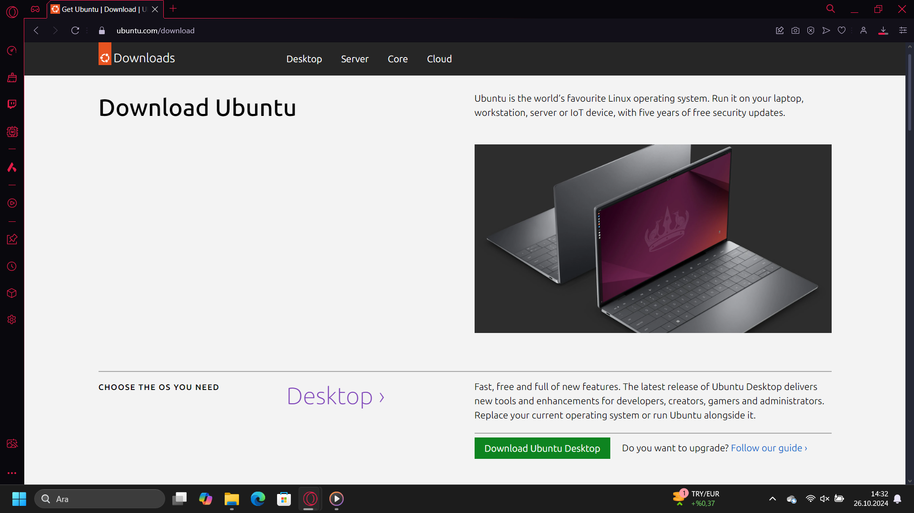
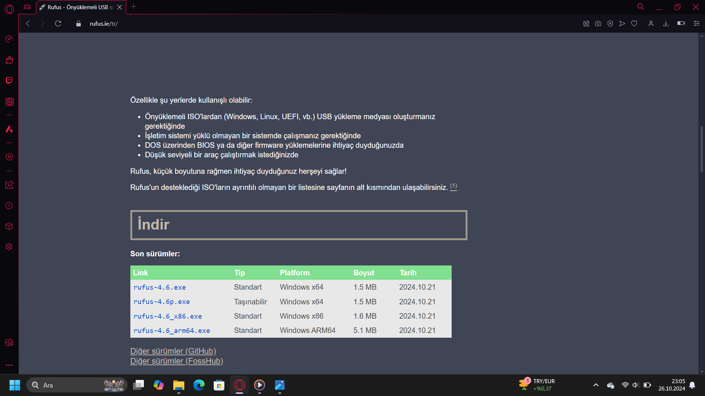
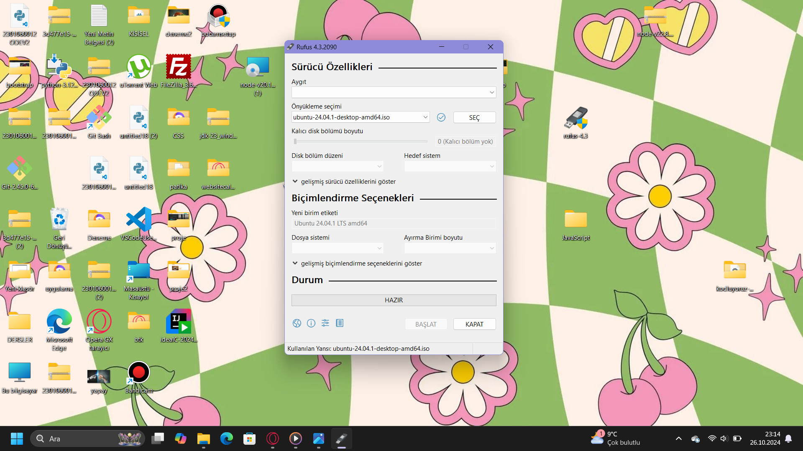
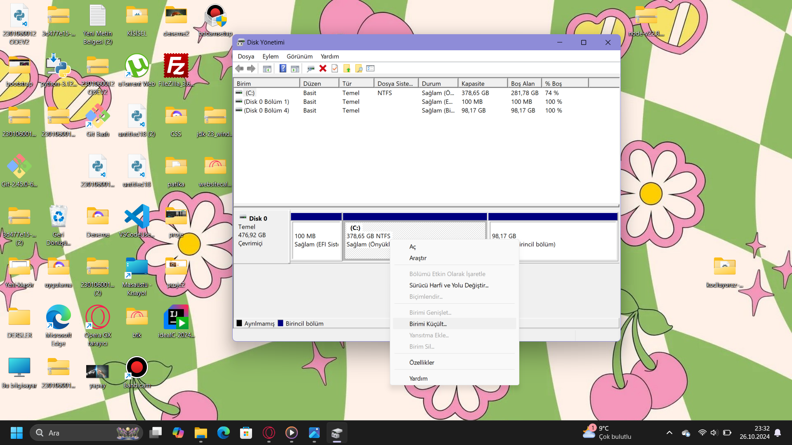

# Ubuntu Sistem Gereksinimleri :
- 2 GHz çift çekirdek işlemci  
- 4 GB RAM bellek  
- 25 GB boş sabit disk alanı  
- 1024 x 768 piksel VGA destekli ekran  
- İnternet erişimi tavsiye edilir  

Gerekli minimum sistem gereksinimlerini karşılayamayan eski bilgisayarlar için, resmî olarak tanınan Ubuntu türevlerinden Lubuntu ya da Xubuntu kullanılabilir. Bu türevleri, hafif bir masaüstü ortamı (LXQt, Xfce) ile geldiklerinden dolayı epey düşük sistem kaynağı tüketirler.

# 1.Ubuntu Download
1.1
Ubuntu resmi sitesine giriyoruz. bu [linkten](www.ubuntu.com) ubuntu resmi sitesine girebilirsiniz.Desktop için Download butonuna tıklıyoruz   

1.2
LTS sürümünü yüklüyoruz.Ubuntu'nun LTS ve LTS olmayan sürümleri arasındaki fark ; LTS, uzun vadeli destek anlamına gelir. LTS sürümleri her iki yılda bir (2020, 2022, vb.) Nisan ayında, LTS olmayan sürümler ise her yıl Ekim ayında ve LTS olmayan yıllarda Nisan ayında yayınlanır.Daha eski bir Ubuntu sürümü yüklüyorsanız, yükleyicinin görsel sunumunun farklı olduğunu göreceksiniz, ancak genel akış benzer kalacaktır.  

# 2.Rufus Download 
Rufus, USB anahtar/bellekler, hafıza kartları vb. gibi USB sürücüleri biçimlendirmeye ve önyüklemeli hale getirmeye yardımcı olan bir araçtır. Rufus kullanarak Ubuntu 24.04 LTS için önyüklenebilir bir USB oluşturmak basit bir işlemdir. 
Bu [linkten](www.rufus.com) rufusun resmi sitesine gidebirisiniz.  

# 3.Rufusu önyüklemeye hazır hale getirme
Rufusu açıyoruz.Flash belleğimizi takıyoruz.Aygıtımızı flash belleğimizi seçiyourz. Önyükleme seçimine bilgisayarımıza indirdiğimiz ubuntu yu seçiyoruz.Başlat butonuna tıklıyoruz.Diske yazma işlemleri başlıyor.  

# 4.Disk Bölümü Ayarlama 
Ubuntu yu windows dan farklı bir yere kuracağımız için ssd mizde bir disk ayırmamız gerekiyor.Bunu isterseniz Windows içinde isterseniz Boot menüsünden sonra yapabilirsiniz.Ben windows da yapmayı tercih ediyorum. O yüzden öncelikle başlata sağ tık yapıp disk yönetimine girmemiz gerekiyor.
Gözüken boş alandan istediğimiz kadarını küçültüp bunu Ubuntu için ayıracağım.  

Şimdi sırada bilgisayarı kapatıp Ubuntu yu kurmak var.Öncelikle bilgisayarı boot menüsüne sokmamız gerekiyor.

# 5.Ubuntu Kurulum 
- Flash belleğimizi bilgisayar kapalıyken takalım
- bilgisayarımızı boot menüsüne sokalım
- karşımıza çıkan seçeneklerden USB üzerinden başlatacağımız için UEFI: USB DISK olan seçeneği seçiyoruz.
- Karşımıza grup versiyon açılacak.Bize ne yapmak istedğimizi soruyor. Biz Ubuntu yu indireceğimiz için Yry or Install Ubuntu seçeneğine gelip enter a basıyoruz.

